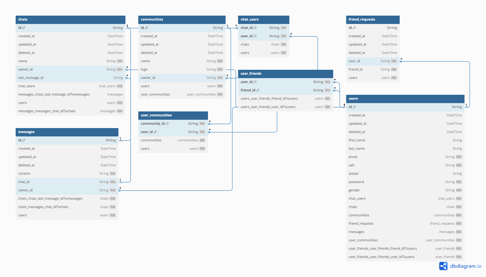

# Meta Clone
- Link messenger web: https://meta-clone-messenger-web.vercel.app/
- Link facebook web: https://meta-clone-facebook-web.vercel.app/

## Technology

### Tools
- ✅ Husky for Git Hooks
- ✅ Linter with ESLint
- ✅ Type checking TypeScript
- ✅ Monorepo with Turborepo
- ✅ CI-CD with auto deployment 

### Backend
- ✅ Server with Gin ( Golang Server )
- ✅ Database with Postgresql and Neon
- ⌛ Caching with Redis 
- ⌛ Limit connection with Redis
- ✅ Serverless with AWS Lambda Zip, API Gateway, Cloudfront

### Frontend
- ✅ Sveltekit ( Messenger )
- ✅ Nuxt ( Facebook )
- ✅ UI Library with shacdn-ui
- ✅ Deploy on Vercel 
- ✅ Emoji picker with emoji-mart

### Requirements
- Node.js 21+ and pnpm
- Go 1.21.4

## System Design


## ERD Diagram



## Start project 

```
git clone https://github.com/tranthaison1231/meta-clone.git
pnpm install
cd apps/messenger-web && ln -s ../../.env .env
cd apps/facebook-web && ln -s ../../.env .env
cd apps/api && ln -s ../../.env .env
pnpm run dev
```

